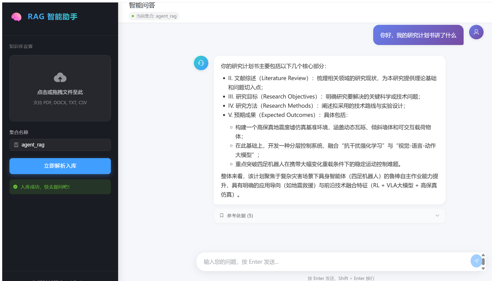

# AI Vector Database & RAG System：从零构建智能知识库



## 📖 项目介绍 (Project Introduction)

欢迎来到 **AI Vector Database & RAG System** 项目。
如果你是一个 AI 领域的初学者，或者是一位想要从传统的 Web 开发转型为 AI 应用开发的工程师，本项目将是你最好的起点。

本项目演示了如何结合 **Milvus**（开源向量数据库）、**LangChain**（大模型应用开发框架）和 **DashScope**（通义千问大模型），构建一个**私有知识库问答系统**。

### ✨ 你将收获什么？

*   🎓 **从小白到入门**：用通俗易懂的语言理解 RAG、向量数据库、Embedding 等核心概念。
*   🏗️ **完整的架构视野**：不只是代码片段，而是完整的前后端分离架构。
*   🔍 **逐行代码拆解**：结合源码能让你读懂核心代码，理解每一行背后的思考。
*   🛠️ **实战技能**：掌握文档切分、向量存储、混合检索、Prompt 工程等 AI 开发必备技能。

---

## 🚀 效果演示 (Demo)

支持本地文件上传并结合大模型回答基于本地文档的问题内容：


---

## 🛠️ 复现教程 (Reproduction Guide)

以下步骤将指导你在本地运行整个前后端系统。

### 1. 环境准备 (Prerequisites)
*   **Python 3.8+**
*   **Node.js** (用于前端运行)
*   **Milvus 数据库**：建议通过 Docker 本地部署（默认运行在 `localhost:19530`）
*   **DashScope API Key**：需要前往阿里云百炼平台申请通义千问 API 密钥。

### 2. 后端配置与运行 (Backend)

**① 安装依赖**  
进入项目后端所在环境（推荐使用虚拟环境），安装所需的 Python 依赖：
```bash
pip install -r requirements.txt
```

**② 配置环境变量**  
确保在项目的 `.env` 配置文件中填入你的 API Key 及其他相关配置（如 Milvus 连接信息）：
```dotenv
# Milvus Configuration
MILVUS_HOST=localhost
MILVUS_PORT=19530
COLLECTION_NAME=agent_rag

# DashScope / LLM Configuration
DASHSCOPE_API_KEY=your_dashscope_api_key_here
EMBEDDING_MODEL=text-embedding-v1
LLM_BASE_URL=https://dashscope.aliyuncs.com/compatible-mode/v1
LLM_MODEL=qwen-plus

# Flask Server Configuration
FLASK_HOST=0.0.0.0
FLASK_PORT=5000
FLASK_DEBUG=True
```

**③ 启动后端服务**  
在项目外层目录（如 `F:\mult_agent`）下通过模块方式启动服务端：
```bash
python -m example.vector_databases.server
```

### 3. 前端配置与运行 (Frontend)

进入前端项目目录进行安装并启动服务：
```bash
cd rag_front
npm install
npm run dev
```
*访问 `http://localhost:5173` 即可看到系统聊天及文件库管理界面。*

---

## 🧩 系统架构与流程 (Architecture)

### 1. 数据入库流程 (Ingestion Pipeline)
这是知识库的"消化系统"。我们将文档读取、切分、转化成向量并存入数据库。
原始文档 (PDF/TXT) ➡️ Document Loader (加载) ➡️ Text Splitter (切分) ➡️ Embedding Model (向量化) ➡️ Milvus 向量数据库

### 2. 问答检索流程 (RAG Pipeline)
这是知识库的"大脑反应"。
用户提问 ➡️ 对问题做 Embedding ➡️ 在 Milvus 进行向量相似度检索返回相关文档 ➡️ 构建 Prompt (问题+参考资料) ➡️ 调用大语言模型 (通义千问) ➡️ 生成最终回答

---

## 🔍 代码模块说明

*   `vector_db_manager.py`：负责连接 Milvus、文档加载、文本切分以及写入向量数据库的管家角色。
*   `vector_retriever.py`：智能检索与问答的大脑，处理向量相似度搜索和生成上下文回答。
*   `document_loader.py`：负责从各类文档格式（如 txt, pdf 等）中解析出纯文本。
*   `server.py`：Flask 服务端应用，提供后端 API 支持。
*   `.env`：核心配置文件，包含密钥、端口、模型名等。
*   `requirements.txt`：Python 依赖清单。
